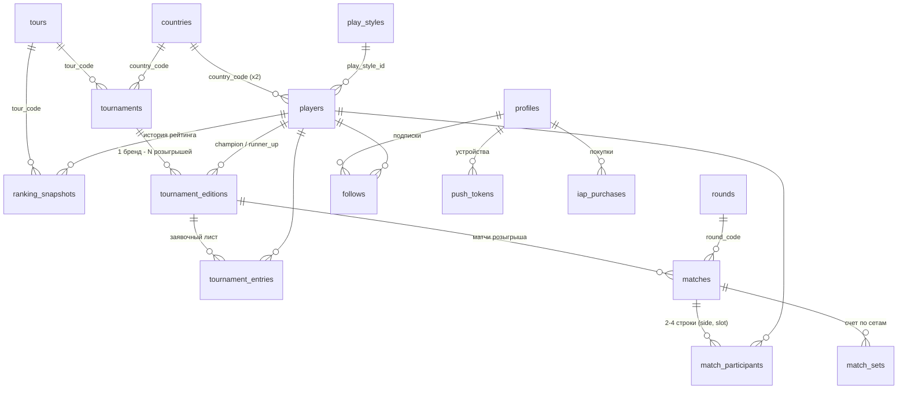

# Схема БД теннисного приложения (Supabase Postgres)

Целевая схема для переезда с `config.json` на реляционную базу.
Принципы: нормализованное ядро + именованные jsonb-точки расширения (без EAV);
surrogate PK + `slug` как внешний идентификатор; вычислимое не хранится (view);
закрытые списки — enum, растущие списки — lookup-таблицы.

---

## 1. Enum-типы (закрытые списки)

| Тип | Значения | Где используется |
|---|---|---|
| `surface_t` | `hard`, `clay`, `grass`, `carpet` | покрытие корта |
| `hand_t` | `right`, `left` | рабочая рука игрока |
| `gender_t` | `m`, `f` | задел под WTA |
| `discipline_t` | `singles`, `doubles`, `mixed` | задел под пары |
| `match_status_t` | `scheduled`, `live`, `completed`, `cancelled` | статус матча |
| `match_outcome_t` | `normal`, `retirement`, `walkover`, `default` | как завершился матч |
| `entry_status_t` | `main`, `qualifying`, `withdrawn`, `alternate` | статус заявки на турнир |
| `push_token_kind_t` | `apns`, `apns_live_activity`, `fcm` | тип пуш-токена |
| `iap_environment_t` | `production`, `sandbox` | окружение Apple |

Локализуемые тексты везде хранятся как jsonb вида `{"ru": "...", "en": "..."}`.

---

## 2. Справочники (lookup-таблицы)

### `tours` — туры (ATP сейчас, WTA/Challenger потом = INSERT, не миграция)
| Колонка | Тип | Описание |
|---|---|---|
| `code` | `text` **PK** | `'atp'`, `'wta'`, `'challenger'` |
| `name` | `text not null` | название |
| `metadata` | `jsonb default '{}'` | точка расширения |

### `countries` — страны (ISO 3166-1 alpha-2)
| Колонка | Тип | Описание |
|---|---|---|
| `code` | `char(2)` **PK** | `'IT'`, `'ES'` |
| `name` | `jsonb not null` | `{"ru":"Италия","en":"Italy"}` |
| `flag_emoji` | `text` | 🇮🇹 |

### `play_styles` — стили игры (контент, не enum: name + description)
| Колонка | Тип | Описание |
|---|---|---|
| `id` | `bigint identity` **PK** | |
| `slug` | `text not null unique` | `'aggressive_baseliner'` |
| `name` | `jsonb not null` | локализуемое название |
| `description` | `jsonb default '{}'` | локализуемые буллеты |

### `rounds` — раунды (нужен порядок сортировки для сетки)
| Колонка | Тип | Описание |
|---|---|---|
| `code` | `text` **PK** | `'R128'…'R16'`, `'QF'`, `'SF'`, `'F'`, `'RR'`, `'R1'…'R4'`, `'Q1'…'Q3'` |
| `label` | `jsonb not null` | `{"ru":"1/4 финала","en":"Quarterfinal"}` |
| `sort_order` | `smallint not null` | F=100, SF=90, QF=80… |

---

## 3. Контент-ядро

### `players` — игроки (и ростер, и соперники извне)
| Колонка | Тип | Описание |
|---|---|---|
| `id` | `bigint identity` **PK** | |
| `slug` | `text not null unique` | `'sinner'` — внешний идентификатор |
| `first_name` / `last_name` | `text` | |
| `display_name` | `text not null` | `'Jannik Sinner'` |
| `gender` | `gender_t default 'm'` | |
| `photo_url` | `text` | бывший `avatar_url` |
| `birth_date` | `date` | возраст вычисляется |
| `hand` | `hand_t` | левша/правша |
| `height_cm` | `smallint` | |
| `country_code` | `char(2)` **FK → countries** | за какую страну играет |
| `birth_country_code` | `char(2)` **FK → countries** | откуда родом |
| `play_style_id` | `bigint` **FK → play_styles** | |
| `traits` | `jsonb default '{}'` | бывший `temperament`: `{"ru":["стабильность",…]}` |
| `pro_tip` | `jsonb default '{}'` | `{"ru":"Синнер тяжело переносит жару…"}` |
| `links` | `jsonb default '{}'` | `{"latestInterview": url, "latestHighlight": url}` |
| `attributes` | `jsonb default '{}'` | точка расширения под «прочие параметры» |
| `is_tracked` | `boolean not null default false` | true = ростер приложения (102), false = соперник извне |
| `created_at` / `updated_at` | `timestamptz` | |

### `ranking_snapshots` — рейтинг как история снапшотов
| Колонка | Тип | Описание |
|---|---|---|
| `id` | `bigint identity` **PK** | |
| `player_id` | `bigint not null` **FK → players** (cascade) | |
| `tour_code` | `text not null` **FK → tours** | |
| `snapshot_date` | `date not null` | |
| `rank` | `integer not null` | позиция |
| `points` | `integer` | очки рейтинга (бывший `ytdPoints`) |
| `race_points` | `integer` | Race to Turin (бывший `seasonPoints`) |

Unique: `(player_id, tour_code, snapshot_date)`.
Текущий рейтинг и тренд/дельта — view `v_current_rankings`, не хранятся.

### `tournaments` — турнир как постоянная сущность («бренд»)
| Колонка | Тип | Описание |
|---|---|---|
| `id` | `bigint identity` **PK** | |
| `slug` | `text not null unique` | `'wimbledon'` |
| `name` | `text not null` | бренд-имя, не локализуем |
| `tour_code` | `text not null` **FK → tours** `default 'atp'` | |
| `description` | `jsonb default '{}'` | локализуемое описание |
| `location` | `text` | `'London, UK'` |
| `country_code` | `char(2)` **FK → countries** | |
| `logo_url` | `text` | |
| `default_surface` | `surface_t` | |
| `conditions` | `jsonb default '{}'` | `{"altitude_m":1500,"rain_risk":"high","indoor":false}` |
| `metadata` | `jsonb default '{}'` | точка расширения |

### `tournament_editions` — розыгрыш конкретного года
| Колонка | Тип | Описание |
|---|---|---|
| `id` | `bigint identity` **PK** | |
| `tournament_id` | `bigint not null` **FK → tournaments** (cascade) | |
| `year` | `smallint not null` | |
| `slug` | `text not null unique` | `'wimbledon_2026'` |
| `start_date` / `end_date` | `date not null` | check: `end_date >= start_date` |
| `surface` | `surface_t not null` | может отличаться год от года |
| `discipline` | `discipline_t default 'singles'` | |
| `draw_size` | `smallint` | 32/64/128 — для отрисовки сетки |
| `prize_money` | `numeric(12,0)` | |
| `prize_currency` | `char(3) default 'USD'` | |
| `champion_id` / `runner_up_id` | `bigint` **FK → players** | явно: у исторических розыгрышей нет матчей |
| `metadata` | `jsonb default '{}'` | |

Unique: `(tournament_id, year, discipline)`.
Статус (upcoming/ongoing/completed) **вычисляется из дат** — view `v_tournament_editions`.

### `tournament_entries` — заявочный лист (бывший массив `players[]`)
| Колонка | Тип | Описание |
|---|---|---|
| `edition_id` | `bigint not null` **FK → tournament_editions** (cascade) | **PK (1/2)** |
| `player_id` | `bigint not null` **FK → players** (cascade) | **PK (2/2)** |
| `seed` | `smallint` | номер посева |
| `status` | `entry_status_t default 'main'` | |

### `matches` — матч (ОДНА строка вместо зеркальных дублей)
| Колонка | Тип | Описание |
|---|---|---|
| `id` | `bigint identity` **PK** | |
| `edition_id` | `bigint not null` **FK → tournament_editions** (cascade) | связь с турниром |
| `round_code` | `text not null` **FK → rounds** | |
| `discipline` | `discipline_t default 'singles'` | |
| `scheduled_at` | `timestamptz` | null = время не назначено |
| `court` | `text` | `'Centre Court'` |
| `status` | `match_status_t default 'scheduled'` | |
| `winner_side` | `smallint` check `in (1,2)` | check: completed ⇒ winner_side not null |
| `outcome` | `match_outcome_t` | retirement / walkover / default |
| `live_state` | `jsonb default '{}'` | эфемерное: `{"current_set":2,"games":"3-2","serving":1,"point":"30-15"}` |
| `bracket_pos` | `smallint` | позиция в раунде для сетки |
| `import_key` | `text unique` | legacy-id для идемпотентной миграции |
| `metadata` | `jsonb default '{}'` | |
| `created_at` / `updated_at` | `timestamptz` | |

Покрытие корта наследуется от `tournament_editions.surface` (не дублируется).
Индексы: `(edition_id, round_code)`; partial по `scheduled_at where status in ('scheduled','live')`; partial `where status='live'`.

### `match_participants` — участники матча
| Колонка | Тип | Описание |
|---|---|---|
| `match_id` | `bigint not null` **FK → matches** (cascade) | **PK (1/3)** |
| `side` | `smallint` check `in (1,2)` | **PK (2/3)** — сторона сетки |
| `slot` | `smallint default 1` check `in (1,2)` | **PK (3/3)** — slot 2 = второй игрок пары (будущее) |
| `player_id` | `bigint not null` **FK → players** | |

TBD-соперник = **отсутствие строк** у стороны. Одиночки: по одной строке на сторону (slot=1).
Индекс: `(player_id, match_id)` — «все матчи игрока».

### `match_sets` — структурированный счёт по сетам
| Колонка | Тип | Описание |
|---|---|---|
| `match_id` | `bigint not null` **FK → matches** (cascade) | **PK (1/2)** |
| `set_no` | `smallint` check `1..5` | **PK (2/2)** |
| `side1_games` / `side2_games` | `smallint not null` | геймы каждой стороны |
| `tiebreak_loser_points` | `smallint` | `'7-6(4)'` → 4; null = тай-брейка не было |

Текстовая строка счёта («6-4, 6-7(3), 6-3») и «won/lost глазами игрока» — view `v_player_matches`.

---

## 4. Пользовательский блок

### `profiles` — зеркало auth.users (создаётся триггером)
| Колонка | Тип | Описание |
|---|---|---|
| `user_id` | `uuid` **PK, FK → auth.users** (cascade) | анонимный вход создаёт uid; привязка Apple/email линкуется к тому же uid |
| `created_at` | `timestamptz` | |
| `settings` | `jsonb default '{}'` | локаль, флаги фич |

### `follows` — подписки на игроков
| Колонка | Тип | Описание |
|---|---|---|
| `user_id` | `uuid not null` **FK → profiles** (cascade) | **PK (1/2)** |
| `player_id` | `bigint not null` **FK → players** (cascade) | **PK (2/2)** |
| `created_at` | `timestamptz` | |

Индекс: `(player_id)` — «кому слать пуш про матч Синнера».

### `push_tokens` — пуш-токены (несколько устройств на пользователя)
| Колонка | Тип | Описание |
|---|---|---|
| `id` | `bigint identity` **PK** | |
| `user_id` | `uuid not null` **FK → profiles** (cascade) | |
| `device_id` | `text not null` | identifierForVendor / install id |
| `kind` | `push_token_kind_t not null` | `apns` \| `apns_live_activity` \| `fcm` |
| `token` | `text not null` | unique `(token, kind)` |
| `environment` | `iap_environment_t default 'production'` | |
| `context` | `jsonb default '{}'` | live activity: `{"match_id":123,"activity_id":"…"}` |
| `created_at` / `last_seen_at` | `timestamptz` | |

### `iap_purchases` — покупки App Store (append-only лог транзакций)
| Колонка | Тип | Описание |
|---|---|---|
| `id` | `bigint identity` **PK** | |
| `user_id` | `uuid not null` **FK → profiles** (cascade) | |
| `product_id` | `text not null` | `'pro_monthly'` |
| `original_transaction_id` | `text not null` | ключ restore purchases |
| `transaction_id` | `text not null unique` | каждое продление = новая строка |
| `purchased_at` | `timestamptz not null` | дата активации/продления |
| `expires_at` | `timestamptz` | null = non-consumable |
| `price_amount` | `numeric(10,2)` | |
| `price_currency` | `char(3)` | |
| `environment` | `iap_environment_t default 'production'` | |
| `is_revoked` | `boolean default false` | refund / family revoke |
| `raw_transaction` | `jsonb default '{}'` | декодированный JWS от Apple |
| `created_at` | `timestamptz` | |

Пишет только edge function после верификации JWS у Apple, не клиент.
Актуальное право доступа — view `v_active_entitlements`.

---

## 5. View (вычислимое не храним)

| View | Что даёт |
|---|---|
| `v_current_rankings` | последний снапшот на игрока/тур + дельта к предыдущему (тренд) |
| `v_tournament_editions` | editions + статус `upcoming/ongoing/completed` из дат |
| `v_player_matches` | матч «глазами игрока»: opponent_id, result won/lost, текстовый счёт с инверсией по стороне — воспроизводит старую JSON-модель |
| `v_active_entitlements` | действующие подписки: `user_id, product_id, max(expires_at)` без revoked/истёкших |

---

## 6. Связи между сущностями (ER)

`profiles.user_id` = `auth.users.id` (Supabase Auth, 1:1).

---

## 7. RLS (доступ)

- **Контент** (players, tournaments, editions, entries, matches, participants, sets, rankings, справочники): публичное чтение (`anon`, `authenticated`), запись только `service_role` (политик на insert/update нет).
- **Пользовательское** (profiles, follows, push_tokens): полный доступ только к своим строкам — `user_id = auth.uid()`.
- **iap_purchases**: select своих, запись только `service_role` (edge function).

---

## 8. Точки расширения (чтобы не перепридумывать схему)

| Новая идея | Куда ложится без миграции |
|---|---|
| Новое поле игрока (например, «любимый удар») | `players.attributes` jsonb → при стабилизации выносится в колонку |
| WTA | INSERT в `tours` + `gender='f'` |
| Пары | `match_participants.slot=2`, `discipline='doubles'` |
| Особенность турнира (высокогорье, дождь) | `tournaments.conditions` jsonb |
| Новый тип пуша | `ALTER TYPE push_token_kind_t ADD VALUE` |
| Новый язык текстов | новый ключ в jsonb-полях (`"es": …`) |
| Челленджеры / квалификация | `tours` + `entry_status='qualifying'`, `rounds Q1..Q3` уже есть |
